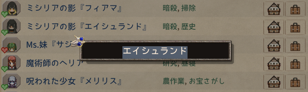

# おしゃべり会話定義の設定項目一覧

## 概要

PartyTalk の会話内容は、JSON ファイルで定義されます。  
キャラクターの名前、またはキャラクターIDごとに会話トピックと発言内容を設定します。

旧設定としてExcelも使用できますが、一部項目が規定値となります。

## 一覧

| 項目                | 必須 | 種類    | 初期値  | 説明                                                   |
| ------------------- | ---: | ------- | ------- | ------------------------------------------------------ |
| `Talks`             | 必須 | array   | -       | 会話定義全体の一覧です。                               |
| `TargetId`          | 必須 | string  | -       | 会話を割り当てる対象の名前、またはキャラクターIDです。 |
| `TargetType`        | 必須 | string  | -       | `TargetId` の解釈方法を指定します。                    |
| `Topics`            | 必須 | array   | -       | 対象に紐づく会話トピック一覧です。                     |
| `TopicId`           | 必須 | string  | -       | 会話トピックを表すIDです。                             |
| `Chance`            | 必須 | integer | -       | 発言候補に入るチャンス値です。                         |
| `Cooldown`          | 任意 | integer | `1`     | 同じトピックが次に発言可能になるまでのターン数です。   |
| `Lines`             | 任意 | array   | -       | 実際に表示される単独発言候補一覧です。                 |
| `TalkSequences`     | 任意 | array   | -       | 連続発言候補一覧です。                                 |
| `Weight`            | 任意 | integer | `1`     | 同一トピック内での抽選重みです。                       |
| `AdditionalTargets` | 任意 | array   | -       | 連続発言の成立に追加で必要な対象一覧です。             |
| `SpeakerId`         | 任意 | string  | -       | 連続発言の各行を発言する対象の名前、またはIDです。     |
| `SpeakerType`       | 任意 | string  | -       | `SpeakerId` の解釈方法を指定します。                   |
| `Text`              | 必須 | string  | -       | 実際に表示される発言テキストです。                     |
| `Portrait`          | 任意 | string  | -       | ポートレート差し替えIDです。                           |
| `Sound`             | 任意 | string  | -       | 再生する音ファイルのIDです。                           |
| `NoGakiConvert`     | 任意 | boolean | `false` | GakiConvert 変換処理を行わないようにするフラグです。   |
| `DelayAfterMs`      | 任意 | integer | -       | 連続発言で次の行へ進むまでの待機ミリ秒数です。         |

## 基本構造

会話定義は、以下のような階層になっています。

```text
Talks
└─ TalkTarget
   ├─ TargetId
   ├─ TargetType
   └─ Topics
      └─ Topic
         ├─ TopicId
         ├─ Chance
         ├─ Cooldown
         ├─ Lines
         │  └─ Line
         │     ├─ Weight
         │     ├─ Text
         │     ├─ Portrait
         │     ├─ Sound
         │     └─ NoGakiConvert
         └─ TalkSequences
            └─ TalkSequence
               ├─ Weight
               ├─ AdditionalTargets
               │  └─ TargetRef
               │     ├─ TargetId
               │     └─ TargetType
               └─ Lines
                  └─ SequenceLine
                     ├─ SpeakerId
                     ├─ SpeakerType
                     ├─ Portrait
                     ├─ Sound
                     ├─ NoGakiConvert
                     ├─ Text
                     └─ DelayAfterMs
```

## 記述例

```json
{
  "Talks": [
    {
      "TargetId": "年上の妹",
      "TargetType": "SimpleName",
      "Topics": [
        {
          "TopicId": "PlayerLvUp",
          "Chance": 10,
          "Lines": [
            {
              "Weight": 1,
              "Text": "おめでとう、お祝いしないとね",
              "Portrait": "UN_olderyoungersister_nico",
            }
          ]
        }
      ]
    }
  ]
}
```

---


## 項目説明

### `Talks`

会話定義全体を入れる配列です。
キャラクターや種族ごとの会話定義を、この中に並べます。

```json
"Talks": [
  {
    "TargetId": "牙姫",
    "TargetType": "SimpleName",
    "Topics": []
  }
]
```

---


### `TargetId`

会話を割り当てる対象を指定します。
指定した値の扱いは、`TargetType` によって変わります。

たとえば、`TargetType` が `SimpleName` の場合はキャラクター名として扱い、`Id` の場合はキャラクターIDとして扱います。

```json
"TargetId": "ロイテル"
```

---


### `TargetType`

`TargetId` の解釈方法を指定します。

| 値           | 説明                                                            |
| ------------ | --------------------------------------------------------------- |
| `SimpleName` | `TargetId` をキャラクター名として扱います。                     |
| `Id`         | `TargetId` をキャラクターIDとして扱います。                     |
| `Any`        | Excel 由来データのフォールバック用です。JSON では使用しません。 |
| `Global`     | グローバル共通会話枠として扱います。                            |

```json
"TargetType": "SimpleName"
```

#### Globalとは？

特定キャラクターではなく、グローバル共通会話枠として扱うための指定です。

`TargetType` に `Global` を指定する場合、`TargetId` は `pc` を推奨します。Mod内では `pc` として扱われます。

`Global`指定を行った場合、TopicIdのうちキャラクター指定でないもの（主にプレイヤーに関するもの、ゾーン等）をキャラクターに依存せず書くことができます。  
主な用途としてはPT外メンバーのみの会話等です。

#### SimpleNameとは？

二つ名等を除いた、キャラクターの名前です。住人掲示板で変更ができる部分になります。  



たとえばパーティーに黒天使が二人いるがそれぞれに違う会話定義を使用したい場合、下記のIdではなくSimpleNameで指定してください。

#### Idとは？

ゲームデータに関するもので、キャラクターの素体Idのようなものです。

例えば、ロイテルが二人いる場合はどちらもuid（ユニークID）は異なりますが、Idは`loytel`とどちらも同じです。  
つまり、TargetTypeを`Id`と指定して、TargetIDを`loytel`とした場合、パーティー内の何人もいるロイテルの、どのロイテルをひっぱたこうが同じ会話定義が使用されます。

主な用途は特定の名前ではなく、例えば名前がランダムである黒天使に会話定義を使用したいとき、黒天使の名前ではなくIdを指定することにより名前がランダムの相手でも特定の会話定義を使用させるためのものです。

Idは気合と根性で調べるほか、以下の方法があります。

- Elin本体のソース出力用引数を使いソースを出力して確認する（導入Modによっては不安定になるかも）
- [Elin Modding Wiki](https://elin-modding.net/ja/)からソースシートの情報を確認する
- 本体のコンソールに次のコマンドをコピペ実行し、パーティー内のIdを画面のログに出力させる

```C# 
cs.eval EClass.pc.party.members.ForEach(member => EClass.pc.Say(member.NameSimple + ": " + member.id + " "));
```
 
#### 会話定義が適用される優先順位

(バグってなければ)以下の優先度で使用されます。

名前: ロイテル Id:loytel の場合

1. "TargetId": "ロイテル" TargetType: "SimpleName"
2. "TargetId": "ロイテル" TargetType: "ANY"
2. "TargetId": "loytel" TargetType: "Id"
2. "TargetId": "loytel" TargetType: "ANY"

---


### `Topics`

対象に紐づく会話トピックの一覧です。
1つの対象に対して、複数の会話トピックを設定できます。

```json
"Topics": [
  {
    "TopicId": "DrinkMilk",
    "Chance": 10,
    "Lines": []
  }
]
```

---


### `TopicId`

会話トピックを表すIDです。
どのタイミングや状況で使われる会話なのかを識別するために使います。

```json
"TopicId": "DrinkMilk"
```

使用できるTopickIdは[使用できるかもしれないId一覧](idlist.md)ページをご確認ください。

---


### `Chance`

このトピックが発言候補に入るチャンス値です。
`0` から `10` の整数で指定します。

値が大きいほど、発言候補に入りやすくなります。

|   値 | 目安                       |
| ---: | -------------------------- |
|  `0` | 通常は候補に入りません。   |
|  `1` | かなり低い確率です。       |
|  `5` | 中くらいの確率です。       |
| `10` | 候補に確実に入る設定です。 |

```json
"Chance": 10
```

---


### `Cooldown`

このトピックが次に発言可能になるまでのターン数です。  
一部のキャラクターが指定される会話IDでのみ利用されます。（死亡時やスキル発動など）

電波に発言をした際、Cooldownが1以上であれば値がその値が設定されます。  
Cooldownが1以上ある場合、そのキャラクターは同じTopicIdの発言の候補から外れます。

プレイヤーが1ターン行動するごとに、クールダウン値が1ずつ減少し、0になると再び候補にあがるようになります。  
`0` を指定した場合は、クールダウンなしとして扱います。

省略時は Mod 側のデフォルト値を使用します。

```json
"Cooldown": 1
```

---


### `Lines`

このトピックで実際に表示される単独発言候補の一覧です。
同じトピック内に複数の `Line` を書くことで、表示される文章にバリエーションを持たせることができます。

`Topic` には `Lines` または `TalkSequences` のどちらか一方、または両方を指定できます。

```json
"Lines": [
  {
    "Text": "こんにちは。"
  },
  {
    "Text": "今日はいい天気だね。"
  }
]
```

---


### `TalkSequences`

連続発言候補の一覧です。  
選ばれた場合、内部の `Lines` が上から順番に表示されます。

単独発言の `Lines` と同じトピック内に書いた場合、単独発言候補と連続発言候補は同列の候補として扱われます。

```json
"TalkSequences": [
  {
    "Weight": 1,
    "Lines": [
      {
        "SpeakerId": "牙姫",
        "SpeakerType": "SimpleName",
        "Text": "ところでなんで#brother2なんだ？"
      },
      {
        "Portrait": "UN_olderyoungersister_nico",
        "Text": "#brother2だからだよ？"
      }
    ]
  }
]
```

---


### `Weight`

同じトピック内で、どの発言が選ばれやすいかを決める重みです。  
数値が大きいほど選ばれやすくなります。

省略した場合は `1` として扱われます。

`TalkSequences` に指定した場合は、単独発言候補や他の連続発言候補と同列に抽選される際の重みになります。

たとえばめったに発言されたくないLineがある場合は、ほかのLineのWeightを上げることで抽選確率を下げることができます。下記の場合おおよそ1/11でレア発言が出るイメージです。

```json
"Lines": [
  {
    "Weight": 10,
    "Text": "よく当たる発言"
  },
  {
    "Weight": 1,
    "Text": "レア発言"
  }
]
```

```json
"Weight": 1
```

---


### `AdditionalTargets`

連続発言の成立に追加で必要な対象を指定します。  
`TalkSequences` 内で使用します。

連続発言内の `SpeakerId` / `SpeakerType` で指定された話者は自動的に必要人物として扱われるため、通常はここに重複して指定する必要はありません。

以下の場合、PTメンバーにロイテルが存在しないと抽選対象になりません。

```json
"AdditionalTargets": [
  {
    "TargetId": "ロイテル",
    "TargetType": "SimpleName"
  }
]
```

---


### `SpeakerId`

連続発言の各行で、どのキャラクターが発言するかを指定します。  
`SpeakerType` とセットで指定します。

```json
"SpeakerId": "ロイテル"
```

---


### `SpeakerType`

`SpeakerId` の解釈方法を指定します。  
使用できる値は `SimpleName` または `Id` です。

```json
"SpeakerType": "SimpleName"
```

---


### `Text`

実際に表示される発言テキストです。  
この項目は必須です。  
ゲーム内で非人間の場合、文書の前後に`()`が追加されます

```json
"Text": "こんにちは。"
```

一部特殊な設定を持たせることができます。一部を除きElin本体の仕様影響を受けます。

例

- `#newline`: 改行
- `#brother2`: お兄ちゃん/お姉ちゃん

詳細は[テキストのコンバートページ](textconvert.md)を参照してください。

---


### `Portrait`

ポートレート差し替えIDを指定します。
指定した場合、その発言で使用するポートレートを変更できます。

連続発言の各行では、`SpeakerId` / `SpeakerType` を指定せずに `Portrait` を指定することで、PTにいないキャラクターも疑似的に会話に参加させられます。  
`SpeakerId` / `SpeakerType` と併用した場合は、その行のポートレート上書きとして扱われます。

省略した場合は、通常のポートレートを使用します。

このポートレートは他ModやCustomフォルダに入れたポートレートも参照できます。  
`~\Steam\steamapps\common\Elin\Custom\Portrait`配下に置くと読み込まれるそうです。読み込まれていればElin内でポートレート候補にあがるようになります。

値の指定はファイル名と同じものを指定します。

このModでは下記のようにいくつかのポートレート画像（本家加工品）を追加して指定しています。

```json
"Portrait": "UN_olderyoungersister_pui"
```

---


### `Sound`（非推奨 非保証）

発言時に再生する音ファイルのIDを指定します。  
省略した場合は、音声なしとして扱います。

Excel 由来のデータでは、指定がない場合 `null`(音声なし) 相当として扱われます。

この設定は**非推奨**（ろくにテストしていない）**非保証**（本体に大きく依存する）です。

カスタムフォルダ等に`Sound\PTC\zako1.wav`のように配置するとElin本体の仕組みで音を呼び出せるようになるそうです。  
配置した状態で`PTC/zako1`のように設定すると再生されます。パスが間違っている場合などは何も音はなりません。  
一度再生されるとwavファイルと同じところにjsonファイルが作成され、音量等の設定ができるようになります。

Sound取り込み・再生のあたりの仕様はElin本体のものであり、本Modは呼び出しだけ行っており管理していません＆設定がよくわからない＆素材作るのが大変という理由で非保証となっています。

```json
"Sound": "PTC/zako1"
```

---


### `NoGakiConvert`

GakiConvert 変換処理を行わないようにするフラグです。  
省略した場合は `false` として扱われます。

| 値      | 動作                           |
| ------- | ------------------------------ |
| `true`  | GakiConvert 変換を行いません。 |
| `false` | GakiConvert 変換を行います。   |

Excel 由来のデータでは、指定がない場合の `false` として扱われます。

```json
"NoGakiConvert": false
```

#### GakiConvertってなんだよ？！

牙姫やコルゴン、赤ちゃんなどが発話する際に「ざこ♡(おかえりんこ)」のようになりますが、この特定の文字+（）括りを指します。

NoGakiConvertとした場合、通常の会話のような発言になります。

---


### `DelayAfterMs`

連続発言の各行を表示した後、次の行へ進むまでの待機時間をミリ秒で指定します。  
`1000` で1秒です。

省略した場合は Mod 側のデフォルト値を使用します。

```json
"DelayAfterMs": 1000
```

---

## 補足

JSON では、スキーマに定義されていない項目は使用できません。Mod読み込み時に警告やエラーになります。  
項目名の大文字・小文字も区別されるため、`Talks` や `TargetId` などは表記を合わせてください。

また、配列で指定する項目は、最低1件以上のデータが必要です。  
たとえば `Talks`、`Topics`、`Lines`、`TalkSequences`、`AdditionalTargets` は空配列ではなく、少なくとも1件以上の要素を入れてください。
