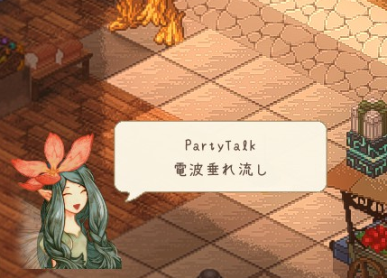
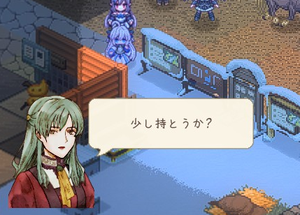
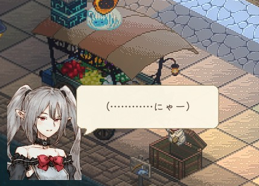
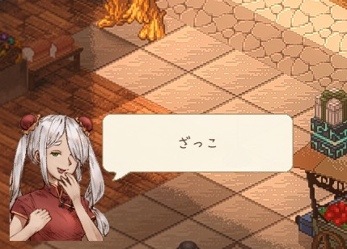
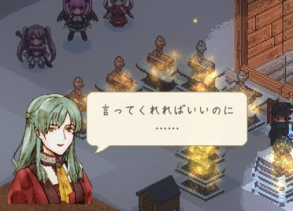

# PartyTalk PTメンバーが電波で(略)

    

        
        
        
        
        
    

  <a class="md-button md-button--primary" href="https://steamcommunity.com/sharedfiles/filedetails/?id=3384121582">
    Steam Workshopで開く
  </a>

電波領域ウィジェットを利用して、パーティーメンバーにしゃべらせるModです。

ゲーム開始時、外にでたり町に入ったり、ボスを倒したりピンチになったりするとパーティーがしゃべってくれます。

!!! warning "注意"
    2026/7月のMod更新により、設定ファイルの規定がExcelからJSONへ変更されました。  
    Excelも引き続き利用することができますが、JSONへの移行をお勧めします。  
    詳しくは[ExcelからJSONへのおしゃべり定義ファイルの移行案内](excel2json.md)のページをご確認ください。

## 主な機能

- **セーブデータ依存なし**。Modの抜き差しは自由にできます。
- JSONによるおしゃべり定義の設定
- キャラクター名または種族ごとのおしゃべり定義
    - 初期サンプルとして「年上の妹」「牙姫」「キリア」が設定されています。
    - 特殊なキャラクターとして「ネルン（ポケットの中のネルン）」も設定でしゃべらせることができます。一人旅でもさみしくない。
- トピックごとの発言管理（頻度・クールダウンなど）
- 他Modのデータ読み込み対応。所定のフォルダに存在するおしゃべり定義を読み込みます。

## はじめて使う場合

サブスクライブするだけで利用開始できます。

サンプルの発言内容が気に食わない場合は以下のサンプルファイルを適宜修正してください。  
配置場所: `～\Steam\steamapps\workshop\content\2135150\3384121582\PartyTalk.json`

うちの子も追加したい場合は追加設定が可能です。[うちの子キャラ追加方法](howtoadd.md)ページをご確認ください。

